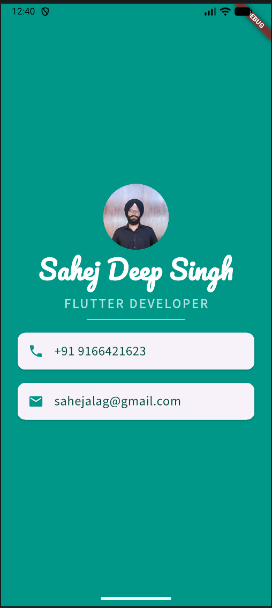

# MiCard - Flutter App

A simple personal business card app built using Flutter.

## Features
- Clean UI design
- Custom fonts and icons
- Contact details display (phone & email)

## Tech Used
- Flutter
- Dart

## Screenshots

## What I Learned
- Flutter layout (Column, Row)
- Widgets and styling
- Asset management